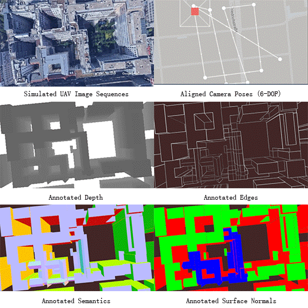

<!-- # Large-Scale UAV Dataset -->
# Derivation of Geometrically and Semantically Annotated UAV Datasets at Large Scales from 3D City Models

__A large-scale UAV dataset for image understanding, multi-view 3D reconstruction, and geo-localization.__

>_This work was presented at [CVPR 2020 (WiCV)](https://sites.google.com/view/wicvworkshop-cvpr2020). The full paper will be presented and published at [ICPR 2020](https://www.micc.unifi.it/icpr2020)._
>
>**Authors:** Sidi Wu, Lukas Liebel, Marco Körner [(Remote Sensing Technology, Technical University of Munich (TUM)](https://www.lmf.lrg.tum.de))


We present a large-scale UAV dataset with simulated UAV image sequences in urban areas and automatically generated pixel-level annotations for depth, surface normals, semantics, and edges of buildings derived from an open CityGML model.

CityGML, as an open data model for the storage and exchange of virtual semantic 3D city models, can serve as a useful source for ground-truth semantic, geometric and topological information about geographical objects.
The standard defines five levels of detail (LoDs) [[2]](#citygml).

We make use of the 3D city model of the Berlin city area in LoD 2, published by the state of Berlin and its Senate Department for Economics, Technology and Research [[3]](#berlinmodel).
We simulate UAV image sequences in [Google Earth Studio](https://www.google.com/earth/studio), align parameters and derive annotations in [Blender](https://www.blender.org/).

For more details, please check our paper [[1]](#wicv) (full paper will be available on arXiv soon).



## Download
We share the simulated dataset with automatically generated annotations (depth, semantics, edges, surface normals) together with the source codes and Blender files allowing to reproduce our results and extend the dataset.

The dataset contains 144000 simulated UAV images acquired over 15 areas distributed in Berlin.
Three different scenarios are considered for simulation:
- the UAV flies at constant speed and with constant viewing
angle (dataset1)
- the UAV flies at constant speed with viewing angles
changing linearly (dataset2)
- the UAV flies at changing speeds with changing viewing
angles (dataset3)

For ground-truth annotations, numpy files are provided for each attribute of each frame:
- depth (float, shape: [270, 480])
- surface normals (float, shape: [270, 480, 3])
- edges (binary, shape: [270, 480])
- semantics (integer, shape: [270, 480]) with class labels: 1 - wall, 2 - flat roof, 3 - tilted roof, 4 - complicated roof, 5 - ground, 0 - unclassified 

_The compressed npy has been saved. Use data.f.arr_0 to unzip the data._

6-DOF parameters are attached, including coordinates (ETRS UTM coordinates + DHHN92 absolute height above sea level), pan and tilt.
No rolling was considered for simulation.

_The full dataset can be downloaded here https://syncandshare.lrz.de/getlink/fiFaHYrhe9EW77DYpQzG5oJo/. There are three sub-datasets corresponding to the mentioned three scenarios. Please use "md5sum" for each sub-dataset and compare the MD5 with our provided "checksums.txt" to see if each sub-dataset is downloaded correctly._  

## Codes
Three blender files are provided for rendering depth + surface normals, semantics and edges, respectively. Those files include python scripting and settings of composition nodes. 

## Citation
Please cite the following paper if our dataset or source codes/files were helpful for your work:
```
@InProceedings{,
  author    = {Sidi Wu and Lukas Liebel and Marco K"orner},
  title     = {Derivation of Geometrically and Semantically Annotated {UAV} Datasets at Large Scales from {3D} City Models},
  booktitle = {International Conference on Pattern Recognition (ICPR)},
  year      = {2020}
}
```

<!-- ## License -->

## References
<a name="wicv">[1]</a> [Extended abstract of our paper as presented at CVPR 2020 (WiCV)](https://drive.google.com/file/d/1bTPz2hKFNVLLf-9XN9ZYCNtmM8mZAYbU/view) (Google Drive, PDF)\
<a name="citygml">[2]</a> [OGC City Geography Markup Language (CityGML) Encoding Standard, Version 2.0](https://portal.opengeospatial.org/files/?artifact_id=47842) (download, PDF) \
<a name="berlinmodel">[3]</a> [CityGML Model of Berlin City](https://daten.berlin.de/tags/3d-stadtmodell) (website, german)
